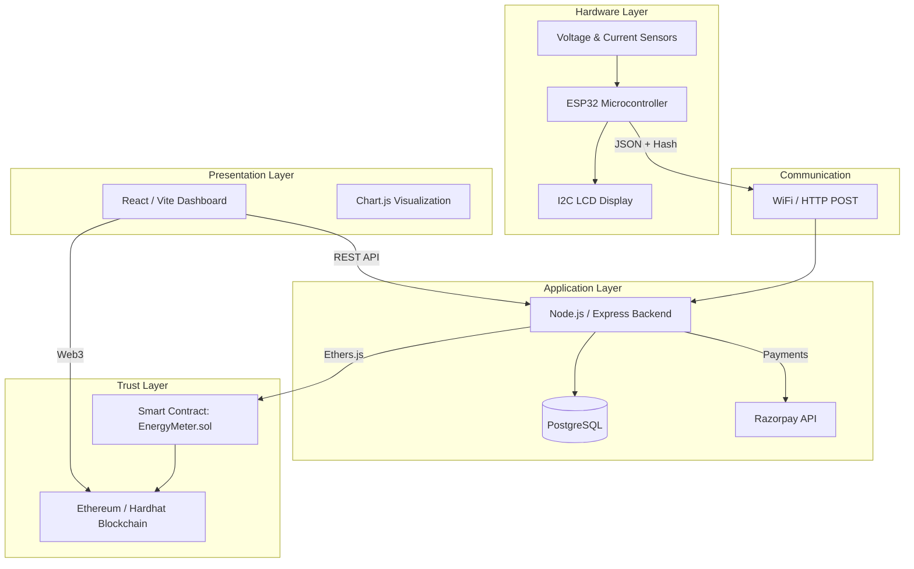

<div align="center">

# ⚡ Blockchain-Powered Smart Energy Meter
### Blockchain-Powered Smart Energy Metering Platform 🌐🔋


[](https://reactjs.org/)
[](https://nodejs.org/)
[](https://soliditylang.org/)
[](https://ethereum.org/)

**ENARGY** is a next-generation smart energy ecosystem that integrates IoT, Blockchain, and modern web technologies to eliminate inefficiencies and ensure transparency in electricity billing systems.

</div>

---

## 📖 Project Overview

ENARGY transforms traditional energy metering into a **secure, tamper-proof, and intelligent system** by leveraging decentralized infrastructure.

### Core Value Proposition
- **🛡️ Immutable Trust Layer**: Blockchain-secured energy readings
- **📡 Real-Time Monitoring**: Live consumption analytics
- **🧾 Automated Billing**: Smart contract-driven logic
- **💳 Seamless Payments**: Integrated billing and payment flow
- **🌐 End-to-End Ecosystem**: Hardware → Backend → Blockchain → UI

---

## 🏗️ System Architecture



---

## 🚀 Key Features

### 🛡️ Secure Energy Tracking
- **Tamper-Proof Readings**: Sensor data hashed on-device and recorded on blockchain
- **Decentralized Trust**: Immutable ledger prevents manipulation

### 📊 Real-Time Monitoring
- Live tracking of:
  - Voltage (V)
  - Current (A)
  - Power (W)
  - Energy Consumption (kWh)

### 🧾 Smart Billing Engine
- Blockchain-backed reading validation
- Automated bill generation foundation

### 💳 Payment Integration
- Razorpay-powered secure payments
- Seamless billing-to-payment pipeline

### 👤 Multi-Role System
- **Admin (Electricity Board)**
- **Consumer Dashboard**

### 📡 IoT Integration
- ESP32-based data acquisition
- Simulation fallback for testing environments

---

## 🛠️ Technology Stack

| Layer | Technologies |
|------|-------------|
| **Frontend** | React, Vite, Tailwind CSS, Chart.js, Lucide |
| **Backend** | Node.js, Express, PostgreSQL, Ethers.js, Razorpay SDK |
| **Blockchain** | Solidity, Hardhat, Ethereum |
| **Hardware** | ESP32, Arduino (C++), ACS712, ZMPT101B, I2C LCD |

---

## 📂 Project Structure

```text
Enargy/
├── backend/
│   ├── blockchain/
│   │   └── client.js
│   ├── db/
│   │   ├── pool.js
│   │   └── schema.sql
│   ├── middleware/
│   │   ├── auth.js
│   │   └── validateReading.js
│   ├── routes/
│   │   ├── billing.js
│   │   ├── energy.js
│   │   └── payment.js
│   ├── scripts/
│   │   ├── create_db.js
│   │   └── test_esp32.js
│   ├── utils/
│   │   └── tariff.js
│   ├── .env.example
│   ├── package.json
│   └── server.js
│
├── blockchain/
│   ├── contracts/
│   │   └── EnergyMeter.sol
│   ├── scripts/
│   │   └── deploy.js
│   ├── hardhat.config.js
│   └── package.json
│
├── esp32_firmware/
│   └── energy_meter/
│       └── energy_meter.ino
│
├── frontend/
│   ├── src/
│   │   ├── pages/
│   │   │   ├── Admin/
│   │   │   └── Consumer/
│   │   ├── services/
│   │   │   └── api.js
│   │   ├── App.jsx
│   │   └── main.jsx
│   ├── index.html
│   └── package.json
│
├── README.md
└── RUN_COMMANDS.md
```

---

## 🚀 Getting Started

### Prerequisites
- Node.js (v18+)
- PostgreSQL
- Hardhat
- Arduino IDE (for ESP32)

---

### 1. Clone Repository
```bash
git clone https://github.com/your-repo/enargy.git
cd enargy
```

---

### 2. Setup Blockchain
```bash
cd blockchain
npm install
npx hardhat node
```

---

### 3. Setup Backend
```bash
cd backend
npm install

# Configure .env
npm run dev
```

---

### 4. Setup Frontend
```bash
cd frontend
npm install
npm run dev
```

---

## 🔑 Default Credentials

| Role | Username | Password |
|------|----------|----------|
| Admin (EB) | EB-Admin | TNEB@ADMIN |
| Consumer | MTR001 | TNEB@MTR001 |

---

## 🔧 Hardware Configuration

Supported Components:

- ESP32 DevKit V1
- I2C LCD 16x2 (Address: `0x27`)
- Current Sensor → Pin `34`
- Voltage Sensor → Pin `35`

⚠️ Ensure:
- `serverName` and `ssid` in `energy_meter.ino` match your network

---

## 🔒 Security & Reliability

- On-device hashing prevents tampering
- Blockchain ensures immutability
- Backend validation for IoT payloads
- Secure payment processing via Razorpay

---

## 📦 Core Capabilities Summary

- IoT-based energy data acquisition
- Blockchain-secured storage
- Real-time analytics dashboard
- Smart billing logic
- Integrated payments
- Multi-role system

---


<div align="center">
  <p>Built with ⚡ for a Transparent Energy Future</p>
  <p>Developed by <strong>Priyan-19</strong></p>
  <p>© 2026 ENARGY Platform. All Rights Reserved.</p>
</div>
